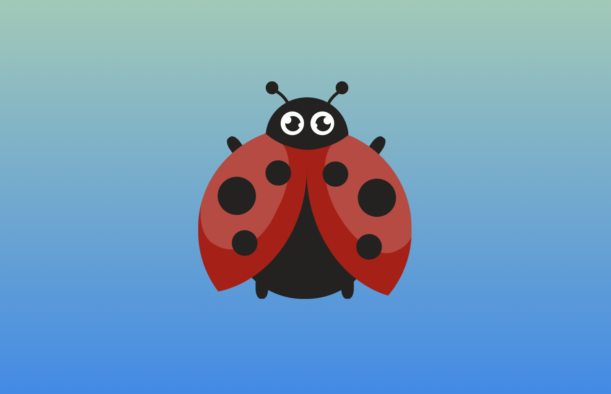
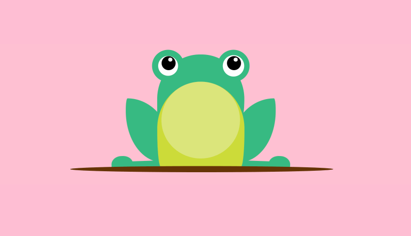
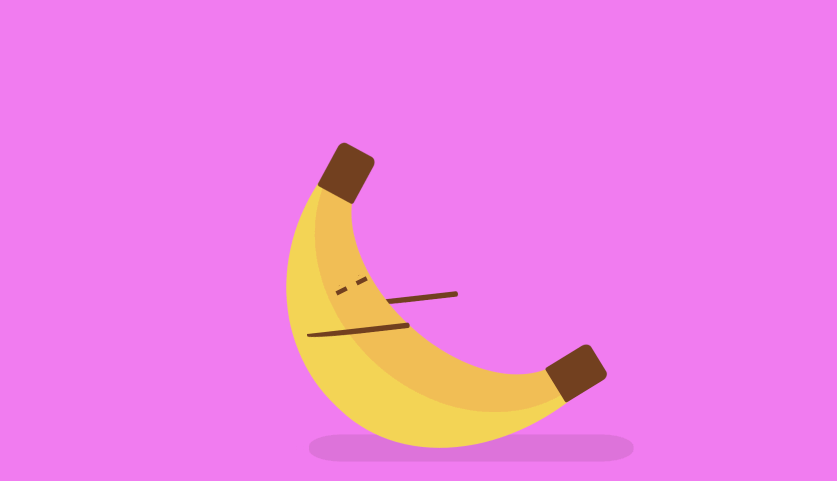

# 🎨 CSS Drawings

Welcome to My CSS Drawings! This repository is not just about showcasing a collection of my funny CSS creations; it's also a journey towards mastering the art of CSS styling in a fun and imaginative way. Here, code meets creativity to paint vivid pictures, all while exploring the depths of CSS with joy and playfulness.

### 1. Ladybug

<a href="https://codepen.io/devdanutie/pen/MWRRmZN">See on codepen </a>

### 2. Frog

<a href="https://codepen.io/devdanutie/pen/bGJyQJP">See on codepen </a>

### 3. Exercising banana

<a href="https://codepen.io/devdanutie/pen/mdgNgJX">See on codepen </a>

